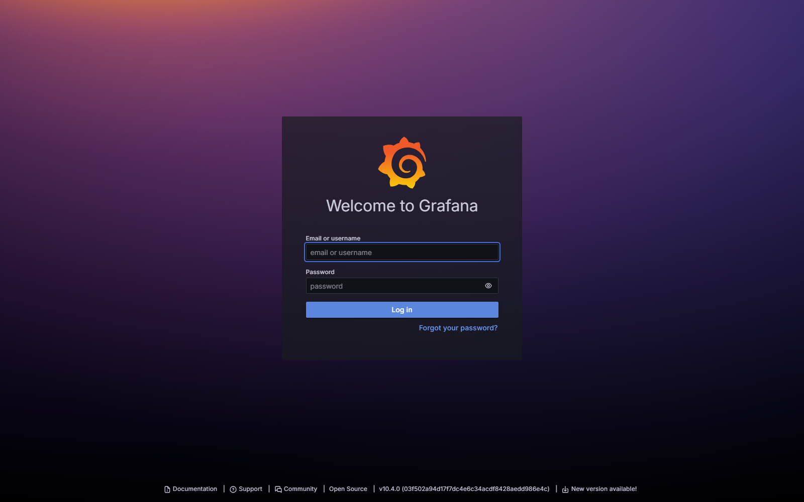
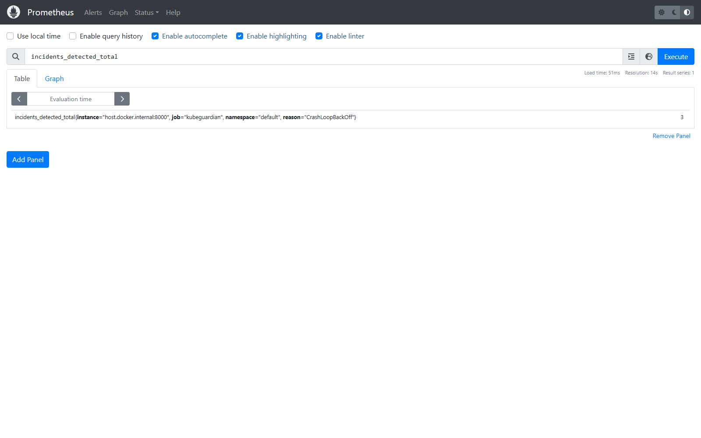
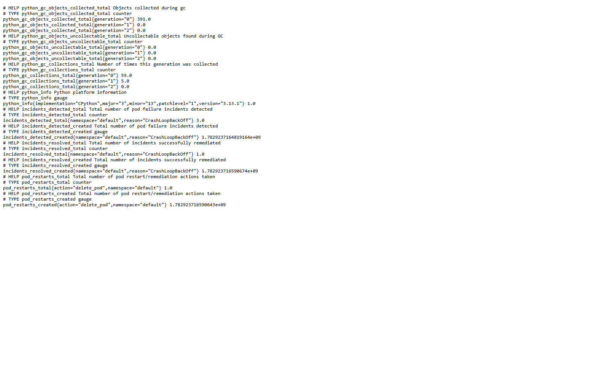
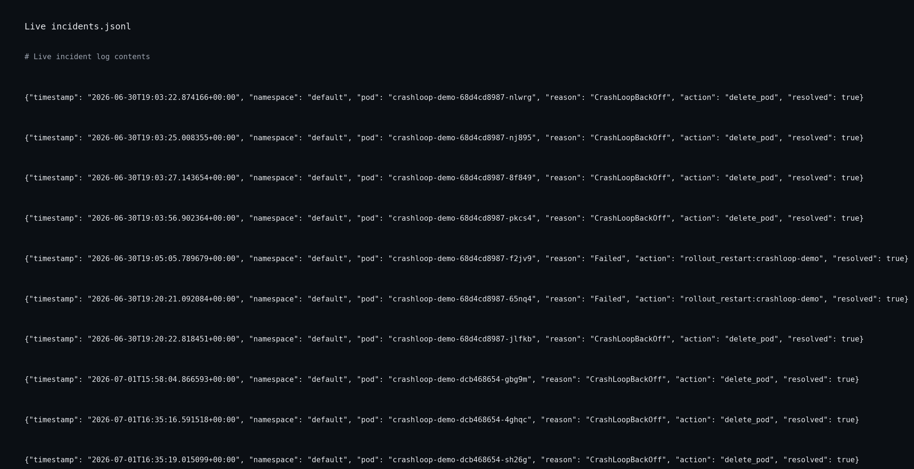
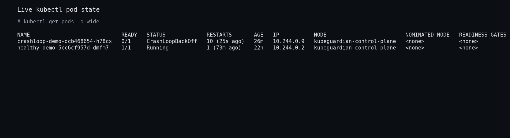

# KubeGuardian

KubeGuardian is a lightweight Kubernetes pod health watcher and auto-healer for **local kind clusters**. It detects failing pods (CrashLoopBackOff, long-running Pending, Failed), remediates them automatically, exports Prometheus metrics, and logs incidents to a JSON-lines file.

> **Scope:** This weekend build targets a local [kind](https://kind.sigs.k8s.io/) cluster only — no cloud IAM, ingress controllers, or multi-cluster federation.

## Live results

These screenshots show real data captured from a running KubeGuardian demo with the controller, Prometheus, and Grafana all active.

The images demonstrate the project goal:
- detecting pod failures in a local kind cluster
- healing crashlooping workloads automatically
- exposing Prometheus metrics for incidents and actions
- logging incidents to a JSON-lines file
- showing live pod state from Kubernetes

| Grafana dashboard | Prometheus query |
|---|---|
|  |  |

| Metrics endpoint output | Incident log |
|---|---|
|  |  |

| Pod state |
|---|
|  |

## Architecture

```
┌─────────────────────────────────────────────────────────────────┐
│                        kind cluster                              │
│  ┌──────────────┐   ┌──────────────┐   ┌──────────────────────┐ │
│  │ crashloop    │   │ healthy-demo │   │ other workloads      │ │
│  │ Deployment   │   │ Deployment   │   │                      │ │
│  └──────┬───────┘   └──────────────┘   └──────────────────────┘ │
└─────────┼───────────────────────────────────────────────────────┘
          │ Kubernetes API (watch)
          ▼
┌─────────────────────────────────────────────────────────────────┐
│                    KubeGuardian Controller                       │
│  ┌──────────┐    ┌─────────────────┐    ┌────────────┐   ┌───────────┐ │
│  │ watcher  │───▶│      healer     │───▶│ incident   │   │ metrics   │ │
│  │ (watch)  │    │ patch annotation│    │ log (jsonl)│   │ :8000     │ │
│  └──────────┘    │  / delete pod   │    └────────────┘   └─────┬─────┘ │
│                  └─────────────────┘                                  │
└──────────────────────────────────────────────────────────┼──────┘
                                                           │ scrape
                                                           ▼
                                              ┌────────────────────┐
                                              │    Prometheus      │
                                              └─────────┬──────────┘
                                                        │
                                                        ▼
                                              ┌────────────────────┐
                                              │     Grafana        │
                                              │   (dashboard)      │
                                              └────────────────────┘
```

### Detection & remediation

| Failure state        | Detection rule                              | Action                          |
|---------------------|---------------------------------------------|---------------------------------|
| CrashLoopBackOff    | Container `waiting.reason`                  | Delete pod (controller recreates)|
| Pending             | Phase Pending longer than threshold         | Rollout restart owning Deployment|
| Failed              | Phase `Failed`                              | Rollout restart owning Deployment|

For Pending/Failed rollout restarts, the healer resolves the owning Deployment by walking `ownerReferences` from pod → ReplicaSet → Deployment (or pod → Deployment when owned directly).

Default **Pending threshold** is 120 seconds (`PENDING_THRESHOLD_SECONDS`). `docker-compose.yml` overrides this to 60 seconds for faster local demos.

A per-workload **cooldown** prevents heal loops. Default is 300 seconds (`HEAL_COOLDOWN_SECONDS`); `docker-compose.yml` sets 120 seconds.

## Project layout

```
kubeguardian/
├── controller/           # Python controller
├── deploy/               # ServiceAccount, RBAC, in-cluster Deployment
├── docs/screenshots/     # README demo screenshots
├── scripts/              # Screenshot generator
├── tests/                # pytest unit tests
├── test-workloads/       # Demo Deployments for kind
├── monitoring/           # Prometheus + Grafana config
├── docker-compose.yml    # Controller + Prometheus + Grafana
├── Dockerfile
├── requirements.txt
└── requirements-dev.txt
```

## Prerequisites

- [Docker](https://docs.docker.com/get-docker/) and Docker Compose
- [kind](https://kind.sigs.k8s.io/docs/user/quick-start/#installation)
- [kubectl](https://kubernetes.io/docs/tasks/tools/)
- Python 3.11+ (for running the controller directly on the host)

## Quick start (kind)

### 1. Create a local kind cluster

```bash
kind create cluster --name kubeguardian
kubectl cluster-info --context kind-kubeguardian
```

### 2. Deploy test workloads

```bash
kubectl apply -f test-workloads/healthy-pod.yaml
kubectl apply -f test-workloads/crashloop-pod.yaml
kubectl get pods -w
```

Within a minute or two the crashloop pod should enter `CrashLoopBackOff`. The healthy pod should stay `Running`.

### 3. Run the controller

**Option A — on the host (recommended for kind)**

The controller reads your local kubeconfig and talks to kind directly:

```bash
python -m venv .venv
source .venv/bin/activate          # Windows: .venv\Scripts\activate
pip install -r requirements.txt
python -m controller.main
```

For incident logs on the host, set a writable path (the default `/var/log/...` path is intended for containers):

```bash
# Windows PowerShell
$env:INCIDENT_LOG_PATH = ".\incidents.jsonl"
python -m controller.main
```

**Option B — via Docker Compose**

```bash
docker compose up --build
```

> **Note (kind + Docker):** kind's API server is usually `https://127.0.0.1:<port>`. From inside a container that address is the container itself, not your host. For docker-compose on Windows/macOS, either run the controller on the host (Option A) or point kubeconfig at `https://host.docker.internal:<port>` (see [kind known issues](https://kind.sigs.k8s.io/docs/user/known-issues/#pod-to-host-port-mapping)).

**Option C — in-cluster (RBAC included)**

Apply least-privilege RBAC and run inside the cluster:

```bash
kubectl apply -f deploy/serviceaccount.yaml
kubectl apply -f deploy/clusterrole.yaml
kubectl apply -f deploy/clusterrolebinding.yaml

docker build -t kubeguardian:latest .
kind load docker-image kubeguardian:latest --name kubeguardian

kubectl apply -f deploy/deployment.yaml
kubectl logs -l app.kubernetes.io/name=kubeguardian -f
```

The ClusterRole grants only what the controller needs: watch/get/list/delete on **pods**, get on **replicasets**, and get/patch on **deployments**. **Patch** is required for Pending/Failed heals — the healer triggers a rollout restart by patching `spec.template.metadata.annotations.kubeguardian/restartedAt`, not by deleting the Deployment. CrashLoopBackOff heals only delete the pod.

This demo uses a **ClusterRole** so the controller can watch all namespaces by default. If you set `WATCH_NAMESPACES` to specific namespaces in production, prefer a namespaced **Role** + **RoleBinding** per namespace instead (same verbs, smaller blast radius).

### 4. Watch it heal

```bash
kubectl get pods -l app=crashloop-demo -w
curl http://localhost:8000/metrics | grep incidents_
```

**Incident log — depends on how you run the controller:**

| Run mode              | How to view the log |
|-----------------------|---------------------|
| Host (Option A)       | `cat incidents.jsonl` (or your `INCIDENT_LOG_PATH`) |
| Docker Compose (B)    | `docker compose exec controller cat /var/log/kubeguardian/incidents.jsonl` |
| In-cluster (Option C) | `kubectl logs -l app.kubernetes.io/name=kubeguardian` and check the mounted volume via exec |

You should see the crashloop pod deleted and recreated, metrics increment, and a JSON line in the incident log.

### 5. Open dashboards

Start Prometheus and Grafana (works with host or compose controller):

```bash
docker compose up prometheus grafana
```

| Service    | URL                          | Credentials   |
|-----------|------------------------------|---------------|
| Metrics   | http://localhost:8000/metrics | —            |
| Prometheus| http://localhost:9090       | —            |
| Grafana   | http://localhost:3000         | admin / admin |

Prometheus scrapes `controller:8000` when the controller runs in Docker Compose, and `host.docker.internal:8000` when the controller runs on the host (Option A).

The **KubeGuardian** dashboard is auto-provisioned under the *KubeGuardian* folder.

## Configuration

Environment variables (see `controller/config.py`):

| Variable                  | Default                              | Description                          |
|---------------------------|--------------------------------------|--------------------------------------|
| `WATCH_NAMESPACES`        | *(all)*                              | Comma-separated list, e.g. `default` |
| `PENDING_THRESHOLD_SECONDS` | `120` (`60` in docker-compose)   | Pending age before incident          |
| `HEAL_COOLDOWN_SECONDS`   | `300` (`120` in docker-compose)      | Min seconds between heals per workload |
| `POLL_INTERVAL`           | `5`                                  | Watch reconnect interval             |
| `METRICS_PORT`            | `8000`                               | Prometheus scrape port               |
| `INCIDENT_LOG_PATH`       | `/var/log/kubeguardian/incidents.jsonl` | JSON-lines log path              |
| `LOG_LEVEL`               | `INFO`                               | Python log level                     |

## Prometheus metrics

| Metric                     | Labels              | Description                |
|---------------------------|---------------------|----------------------------|
| `incidents_detected_total`| `namespace`, `reason` | Failures detected        |
| `incidents_resolved_total`| `namespace`, `reason` | Successful remediations  |
| `pod_restarts_total`      | `namespace`, `action` | Actions taken (`delete_pod`, `rollout_restart`) |

## Incident log format

Each line in `incidents.jsonl`:

```json
{"timestamp": "2026-07-01T12:00:00+00:00", "namespace": "default", "pod": "crashloop-demo-abc123", "reason": "CrashLoopBackOff", "action": "delete_pod", "resolved": true}
```

This file is a stand-in for PostgreSQL persistence in a later phase.

## Demo walkthrough

1. `kind create cluster --name kubeguardian`
2. `kubectl apply -f test-workloads/`
3. `python -m controller.main` in one terminal (set `INCIDENT_LOG_PATH` on Windows)
4. `docker compose up prometheus grafana` in another
5. Deploy crashloop workload and watch Grafana counters climb
6. Confirm healthy-demo pod is never touched

## Roadmap

Planned next phases (not in this build):

- **PostgreSQL** — durable incident store replacing JSON-lines log
- **Helm chart** — package controller for in-cluster deployment
- **GitHub Actions CI/CD** — lint, test, image publish on merge
- **Slack / email alerting** — notify on incidents and failed heals

## Development

```bash
pip install -r requirements-dev.txt
pytest
python -m controller.main
python scripts/generate_screenshots.py   # refresh README demo images
```

Unit tests cover pod failure detection (CrashLoopBackOff, Pending threshold, Failed), heal action routing, cooldown behavior, and Deployment ownership resolution (pod → ReplicaSet → Deployment via `ownerReferences`).

## License

MIT
