<div align="center">

# 🛡️ KubeGuardian

**A Kubernetes controller that watches pod health and automatically remediates failing workloads.**

[](https://www.python.org/)
[](https://kubernetes.io/)
[](Dockerfile)
[](monitoring/prometheus.yml)
[](monitoring/grafana/dashboard.json)
[](LICENSE)

</div>

> **Validated on:** local [kind](https://kind.sigs.k8s.io/) clusters and **Google Kubernetes Engine (GKE)**. The same controller image and RBAC manifests run unmodified on both — see [Deploying to GKE](#deploying-to-gke) for the exact steps and real output from a live run.

## Table of contents

- [Why KubeGuardian?](#why-kubeguardian)
- [Key features](#key-features)
- [Demo](#demo)
- [Architecture](#architecture)
- [How it works](#how-it-works)
- [Tech stack](#tech-stack)
- [Project layout](#project-layout)
- [Getting started](#getting-started)
- [Deploying beyond kind](#deploying-beyond-kind)
- [Configuration](#configuration)
- [Metrics and observability](#metrics-and-observability)
- [RBAC and security](#rbac-and-security)
- [Known limitations](#known-limitations)
- [Roadmap](#roadmap)
- [Development](#development)
- [Contributing](#contributing)
- [License](#license)

## Why KubeGuardian?

Production Kubernetes workloads occasionally enter unhealthy states — `CrashLoopBackOff`, `Pending`, `Failed` — due to bad config, resource pressure, or application bugs. Left alone, these usually need a human to notice and intervene.

KubeGuardian is a small, from-scratch controller that demonstrates how that loop can be automated: it watches cluster state through the Kubernetes API, classifies failures, applies a remediation policy appropriate to the failure type, protects against restart storms with per-workload cooldowns, and exposes everything as Prometheus metrics for observability. It's a learning project focused on controller design and operational tooling, not a replacement for a production-grade operator.

## Key features

- ✅ **Continuous pod watching** across one, several, or all namespaces via the Kubernetes watch API
- ✅ **Failure classification** for `CrashLoopBackOff`, `Pending`, and `Failed` pods
- ✅ **Policy-based remediation** — pod deletion for crash loops, Deployment rollout restarts for stuck/failed pods
- ✅ **Ownership resolution** — walks `Pod → ReplicaSet → Deployment` to find the right workload to restart
- ✅ **Cooldown protection** — per-workload, per-reason cooldown window prevents heal loops
- ✅ **Prometheus metrics** — incidents detected, incidents resolved, and remediation actions taken, all labeled by namespace
- ✅ **Grafana dashboard** — provisioned out of the box against the Prometheus datasource
- ✅ **Incident logging** — every detection and remediation attempt written as JSON-lines
- ✅ **Least-privilege RBAC** — a dedicated ClusterRole with only the verbs the controller actually uses
- ✅ **Three deployment modes** — run on the host, via Docker Compose, or in-cluster
- ✅ **Unit tested** — pytest coverage for detection, healing, cooldown, and ownership resolution logic

## Demo

Live captures from a running KubeGuardian instance — controller, Prometheus, and Grafana all active against a kind cluster.

| Grafana dashboard | Prometheus query |
|---|---|
| 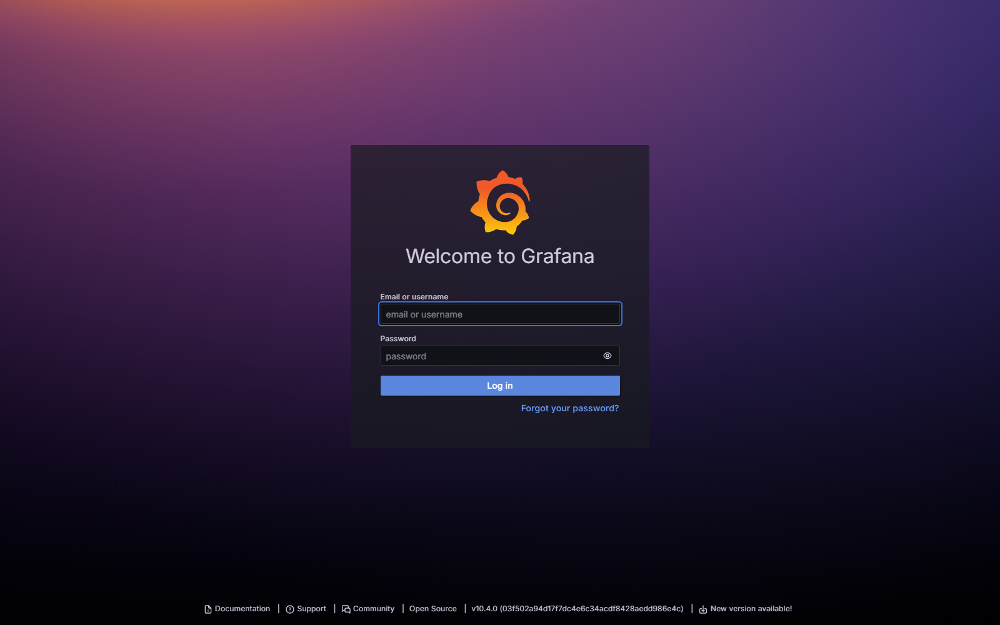 | 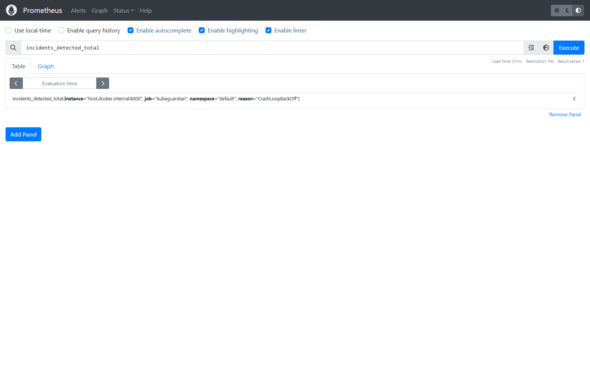 |

| `/metrics` endpoint | `kubectl get pods` |
|---|---|
| 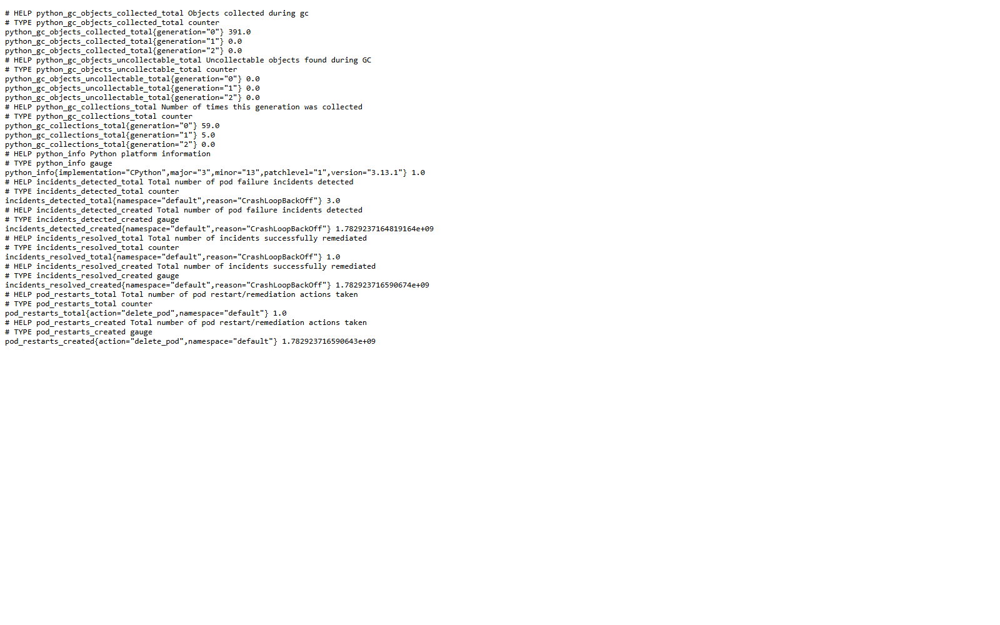 | 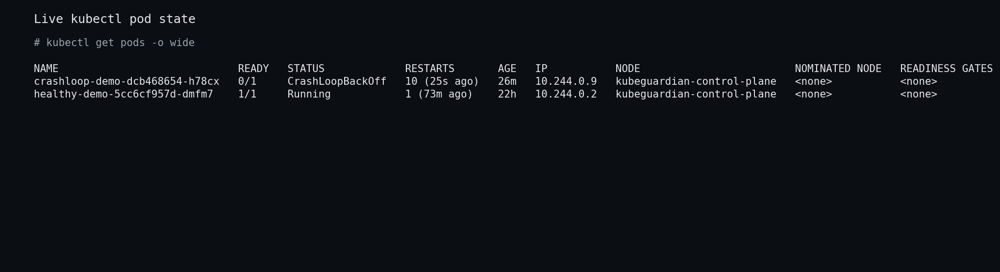 |

**Incident log**

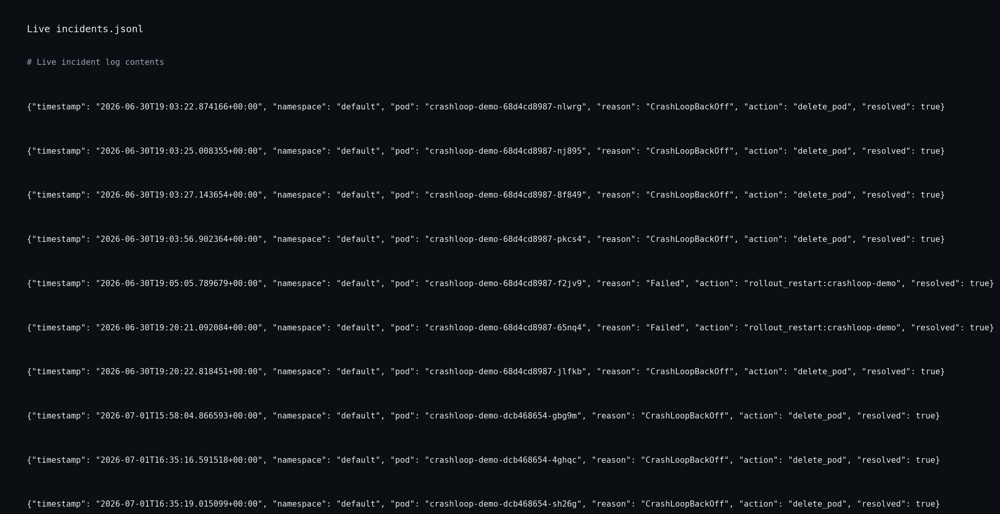

**Running on GKE**

Verified on a live 2-node Autopilot cluster (`kubeguardian`, `asia-south1`, project `kubeguardian-505219`) — context confirmed as `gke_kubeguardian-505219_asia-south1_kubeguardian`, not `kind-kubeguardian`.

| GKE context + controller running | Full detect → heal → cooldown cycle |
|---|---|
| 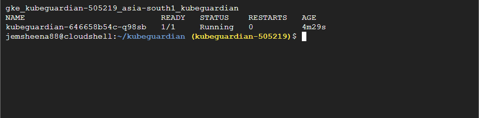 | 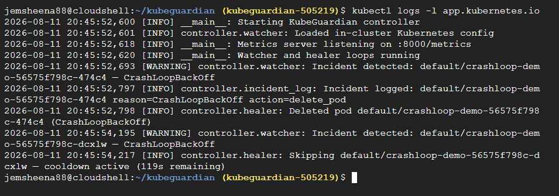 |

| Crashloop pod, second generation | Live incident log entry |
|---|---|
| 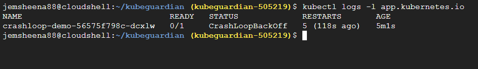 | 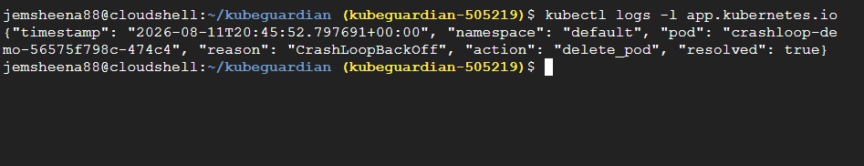 |

| Live Prometheus metrics | Cluster nodes |
|---|---|
| 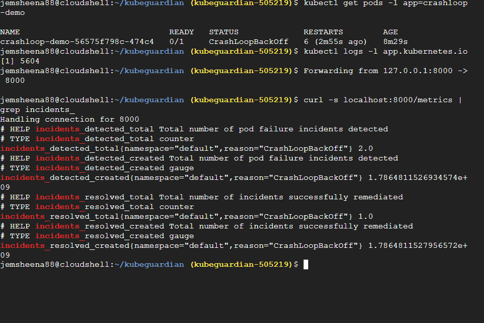 | 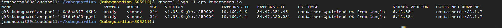 |

**GKE cluster observability (Cloud Console)**

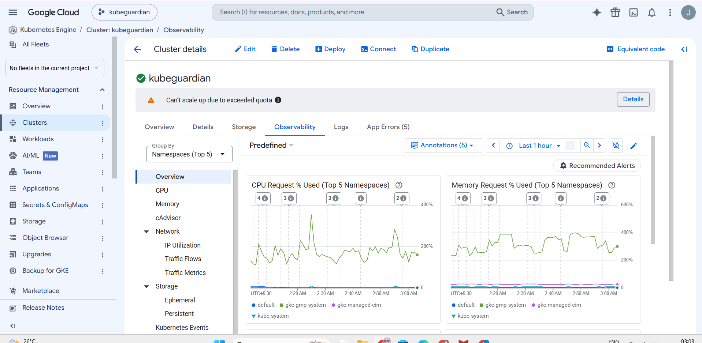

This run shows the full cycle twice, across two controller restarts: detection, remediation (pod delete), a fresh pod recreated by the owning ReplicaSet, and the cooldown window correctly suppressing a second heal on the same workload within 300s.


## Architecture

```text
┌─────────────────────────────────────────────────────────────────┐
│                      Kubernetes cluster                         │
│  ┌──────────────┐   ┌──────────────┐   ┌──────────────────────┐ │
│  │ crashloop    │   │ healthy-demo │   │ other workloads      │ │
│  │ Deployment   │   │ Deployment   │   │                      │ │
│  └──────┬───────┘   └──────────────┘   └──────────────────────┘ │
└─────────┼───────────────────────────────────────────────────────┘
          │ Kubernetes API (watch)
          ▼
┌─────────────────────────────────────────────────────────────────┐
│                    KubeGuardian Controller                      │
│  ┌──────────┐    ┌─────────────────┐   ┌────────────┐  ┌───────┐│
│  │ watcher  │───▶│      healer     │──▶│ incident   │  │metrics││
│  │ (watch)  │    │ patch / delete  │   │ log (jsonl)│  │ :8000 ││
│  └──────────┘    └─────────────────┘   └────────────┘  └───┬───┘│
└──────────────────────────────────────────────────────────────┼──┘
                                                                │ scrape
                                                                ▼
                                                     ┌────────────────────┐
                                                     │     Prometheus     │
                                                     └─────────┬──────────┘
                                                               │
                                                               ▼
                                                     ┌────────────────────┐
                                                     │      Grafana       │
                                                     │    (dashboard)     │
                                                     └────────────────────┘
```

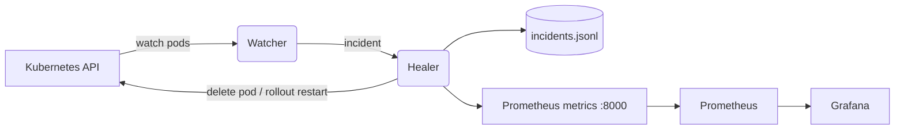
```mermaid
flowchart LR
    A[Kubernetes API] -- watch pods --> B(Watcher)
    B -- incident --> C(Healer)
    C -- delete pod / rollout restart --> A
    C --> D[(incidents.jsonl)]
    C --> E[Prometheus metrics :8000]
    E --> F[Prometheus]
    F --> G[Grafana]
```

## How it works

### Detection and remediation policy

| Failure state | Detection rule | Action |
|---|---|---|
| `CrashLoopBackOff` | Container `waiting.reason` | Delete pod (owning controller recreates it) |
| `Pending` | Phase `Pending` longer than threshold | Rollout restart on the owning Deployment |
| `Failed` | Phase `Failed` | Rollout restart on the owning Deployment |

For `Pending`/`Failed` heals, the healer resolves the owning Deployment by walking `ownerReferences` from pod → ReplicaSet → Deployment (or pod → Deployment when owned directly), then patches a `kubeguardian/restartedAt` annotation on the pod template to trigger a rollout restart.

- Default `Pending` threshold: **120s** (`60s` in the Docker Compose demo profile)
- Default heal cooldown: **300s** per workload+reason (`120s` in the Docker Compose demo profile)

## Tech stack

| Layer | Tools |
|---|---|
| Controller | Python 3.11, [kubernetes](https://github.com/kubernetes-client/python) client library |
| Container | Docker, Docker Compose |
| Local cluster | [kind](https://kind.sigs.k8s.io/) |
| Observability | Prometheus, Grafana |
| Security | Kubernetes RBAC (ServiceAccount, ClusterRole, ClusterRoleBinding) |
| Testing | pytest |

## Project layout

```text
kubeguardian/
├── controller/           # watcher, healer, metrics, incident log, config
├── deploy/               # ServiceAccount, RBAC, in-cluster Deployment manifests
├── docs/screenshots/      # README demo screenshots
├── tests/                # pytest unit tests
├── test-workloads/       # demo Deployments (crashloop + healthy)
├── monitoring/           # Prometheus config + Grafana dashboard/provisioning
├── docker-compose.yml    # controller + Prometheus + Grafana
├── Dockerfile
├── requirements.txt
└── requirements-dev.txt
```

## Getting started

### Prerequisites

- [Docker](https://docs.docker.com/get-docker/) and Docker Compose
- [kind](https://kind.sigs.k8s.io/docs/user/quick-start/#installation)
- [kubectl](https://kubernetes.io/docs/tasks/tools/)
- Python 3.11+ (for running the controller directly on the host)

### Quick start

**1. Create a local kind cluster**

```bash
kind create cluster --name kubeguardian
kubectl cluster-info --context kind-kubeguardian
```

**2. Deploy test workloads**

```bash
kubectl apply -f test-workloads/healthy-pod.yaml
kubectl apply -f test-workloads/crashloop-pod.yaml
kubectl get pods -w
```

Within a minute or two the crashloop pod should enter `CrashLoopBackOff`. The healthy pod should stay `Running`.

**3. Run the controller**

<details>
<summary><strong>Option A — on the host (recommended for kind)</strong></summary>

The controller reads your local kubeconfig and talks to kind directly:

```bash
python -m venv .venv
source .venv/bin/activate          # Windows: .venv\Scripts\activate
pip install -r requirements.txt
python -m controller.main
```

For incident logs on the host, set a writable path (the default `/var/log/...` path is intended for containers):

```powershell
# Windows PowerShell
$env:INCIDENT_LOG_PATH = ".\incidents.jsonl"
python -m controller.main
```
</details>

<details>
<summary><strong>Option B — via Docker Compose</strong></summary>

```bash
docker compose up --build
```

> kind's API server is usually `https://127.0.0.1:<port>`. From inside a container, that address is the container itself, not your host. On Windows/macOS, either run the controller on the host (Option A) or point kubeconfig at `https://host.docker.internal:<port>`.
</details>

<details>
<summary><strong>Option C — in-cluster (RBAC included)</strong></summary>

Apply least-privilege RBAC and run inside the cluster:

```bash
kubectl apply -f deploy/serviceaccount.yaml
kubectl apply -f deploy/clusterrole.yaml
kubectl apply -f deploy/clusterrolebinding.yaml

docker build -t kubeguardian:latest .
kind load docker-image kubeguardian:latest --name kubeguardian

kubectl apply -f deploy/deployment.yaml
kubectl logs -l app.kubernetes.io/name=kubeguardian -f
```
</details>

**4. Watch it heal**

```bash
kubectl get pods -l app=crashloop-demo -w
curl http://localhost:8000/metrics | grep incidents_
```

| Run mode | How to view the incident log |
|---|---|
| Host (Option A) | `cat incidents.jsonl` (or your `INCIDENT_LOG_PATH`) |
| Docker Compose (Option B) | `docker compose exec controller cat /var/log/kubeguardian/incidents.jsonl` |
| In-cluster (Option C) | `kubectl logs -l app.kubernetes.io/name=kubeguardian`, or exec into the mounted volume |

You should see the crashloop pod deleted and recreated, the Prometheus counters increment, and a new JSON line in the incident log.

**5. Open the dashboards**

```bash
docker compose up prometheus grafana
```

| Service | URL | Credentials |
|---|---|---|
| Controller metrics | http://localhost:8000/metrics | — |
| Prometheus | http://localhost:9090 | — |
| Grafana | http://localhost:3000 | admin / admin |

Prometheus scrapes `controller:8000` when the controller runs in Docker Compose, and `host.docker.internal:8000` when it runs on the host.

## Deploying to GKE

KubeGuardian uses no kind-specific APIs — the watcher, healer, and RBAC manifests are built entirely on standard Kubernetes primitives (`pods`, `replicasets`, `deployments`, RBAC), so the same manifests in `deploy/` run unmodified on GKE. Steps below match exactly what was run to validate this project on a live cluster.

**1. Create a GKE Autopilot cluster**

```bash
gcloud container clusters create-auto kubeguardian --region=asia-south1
gcloud container clusters get-credentials kubeguardian --region=asia-south1
kubectl config current-context   # gke_<project-id>_asia-south1_kubeguardian
```

**2. Push the controller image to Artifact Registry**

```bash
gcloud artifacts repositories create kubeguardian \
  --repository-format=docker --location=asia-south1
gcloud auth configure-docker asia-south1-docker.pkg.dev

docker build -t asia-south1-docker.pkg.dev/<project-id>/kubeguardian/kubeguardian:latest .
docker push asia-south1-docker.pkg.dev/<project-id>/kubeguardian/kubeguardian:latest
```

> Autopilot nodes pull images under the default Compute Engine service account. If you see `ErrImagePull` / `403 Forbidden`, grant it read access:
> ```bash
> PROJECT_NUMBER=$(gcloud projects describe <project-id> --format="value(projectNumber)")
> gcloud artifacts repositories add-iam-policy-binding kubeguardian \
>   --location=asia-south1 \
>   --member="serviceAccount:${PROJECT_NUMBER}-compute@developer.gserviceaccount.com" \
>   --role="roles/artifactregistry.reader"
> ```

**3. Update the image reference and apply RBAC + Deployment**

```bash
# In deploy/deployment.yaml, set image: to the Artifact Registry path above
kubectl apply -f deploy/serviceaccount.yaml
kubectl apply -f deploy/clusterrole.yaml
kubectl apply -f deploy/clusterrolebinding.yaml
kubectl apply -f deploy/deployment.yaml
kubectl logs -l app.kubernetes.io/name=kubeguardian -f
```

**4. Scope the watch to your own namespace**

By default the controller watches every namespace, including GKE's own managed system namespaces (`kube-system`, `gke-gmp-system`), which are protected from pod deletion by GKE Warden policy and will fill your logs with 403s. Scope it down:

```bash
kubectl set env deployment/kubeguardian WATCH_NAMESPACES=default
```

**5. Trigger and verify a heal**

```bash
kubectl apply -f test-workloads/crashloop-pod.yaml
kubectl get pods -l app=crashloop-demo -w
kubectl port-forward deploy/kubeguardian 8000:8000
curl -s localhost:8000/metrics | grep incidents_
kubectl exec deploy/kubeguardian -- cat /var/log/kubeguardian/incidents.jsonl
```

**Result:** validated on a 2-node GKE Autopilot cluster (`asia-south1`) — KubeGuardian detected a `CrashLoopBackOff` pod, deleted it, confirmed the ReplicaSet recreated it, and correctly suppressed a second heal on the same workload via the cooldown window. See real log/metrics output in the [Demo](#demo) section above.

## Configuration

Environment variables (see `controller/config.py`):

| Variable | Default | Description |
|---|---|---|
| `WATCH_NAMESPACES` | *(all)* | Comma-separated list, e.g. `default,staging`. On GKE, scope this away from `kube-system`/`gke-gmp-system` — those are Warden-protected and will reject deletes with 403s. |
| `PENDING_THRESHOLD_SECONDS` | `120` (`60` in Docker Compose) | `Pending` age before it's treated as an incident |
| `HEAL_COOLDOWN_SECONDS` | `300` (`120` in Docker Compose) | Minimum seconds between heals for the same workload+reason |
| `POLL_INTERVAL` | `5` | Watch reconnect interval |
| `METRICS_PORT` | `8000` | Prometheus scrape port |
| `INCIDENT_LOG_PATH` | `/var/log/kubeguardian/incidents.jsonl` | JSON-lines incident log path |
| `LOG_LEVEL` | `INFO` | Python log level |

## Metrics and observability

| Metric | Type | Labels | Description |
|---|---|---|---|
| `incidents_detected_total` | Counter | `namespace`, `reason` | Failures detected |
| `incidents_resolved_total` | Counter | `namespace`, `reason` | Successfully remediated incidents |
| `pod_restarts_total` | Counter | `namespace`, `action` | Remediation actions taken (`delete_pod`, `rollout_restart`) |

Each line in `incidents.jsonl`:

```json
{"timestamp": "2026-07-01T12:00:00+00:00", "namespace": "default", "pod": "crashloop-demo-abc123", "reason": "CrashLoopBackOff", "action": "delete_pod", "resolved": true}
```

This file is a stand-in for the PostgreSQL-backed incident store planned in the [roadmap](#roadmap).

## RBAC and security

The controller runs under a dedicated `ServiceAccount` bound to a `ClusterRole` scoped to exactly what it needs — nothing more:

| Resource | Verbs | Why |
|---|---|---|
| `pods` | `get`, `list`, `watch`, `delete` | Watch pod state; delete on `CrashLoopBackOff` |
| `replicasets` | `get` | Resolve pod → ReplicaSet → Deployment ownership |
| `deployments` | `get`, `patch` | Resolve ownership; patch a restart annotation to trigger rollouts |

No cluster-admin, no secrets access, no write access to any resource outside this list. See [`deploy/clusterrole.yaml`](deploy/clusterrole.yaml).

## Known limitations

- **Incident dedup is permanent per pod lifetime, not per cooldown window.** The watcher tracks emitted incidents in an in-memory `namespace/pod-name:reason` set that never expires. In practice this means: once a specific pod has triggered one incident, the watcher won't re-emit for that exact pod again — even after the healer's cooldown period has elapsed — until the controller process restarts. It doesn't cause missed heals in the common case (a heal deletes the pod, so a new pod name naturally gets a clean slate), but a pod that survives in a failing state without being deleted (e.g. skipped by cooldown) won't be re-evaluated until the controller restarts. Fixing this to key on cooldown expiry rather than pod identity is on the roadmap.
- Single-controller-replica design — no leader election, so running >1 replica would double-process incidents.
- No persistent state — the in-memory dedup/cooldown tracking (and the JSON-lines incident log, unless externally mounted) resets on every controller restart.


Planned next phases (not yet in this build):

- 🔲 PostgreSQL — durable incident store replacing the JSON-lines log
- 🔲 Helm chart — package the controller for easier in-cluster installs
- 🔲 GitHub Actions CI/CD — lint, test, and publish images on merge
- 🔲 Alertmanager / Slack notifications — alert on incidents and failed heals
- 🔲 Multi-namespace policy engine — per-namespace remediation rules
- 🔲 Custom Resource Definitions (CRDs) — declarative recovery policies

## Development

```bash
pip install -r requirements-dev.txt
pytest
python -m controller.main
```

Unit tests cover pod failure detection, heal action routing, cooldown behavior, and Deployment ownership resolution.

## Contributing

This is a personal learning project, but issues and pull requests are welcome.

## License

MIT licensed. See [LICENSE](LICENSE).
